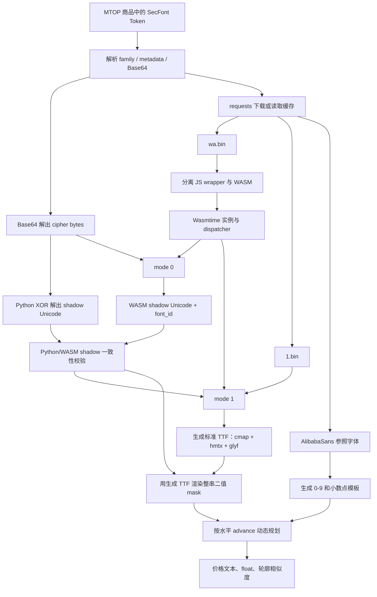

# 天猫 SecFont 字体加密逆向：从 wa.bin、1.bin 到无 OCR 本地解码

> **项目类型**：Web 字体逆向、WASM 协议恢复、Python 工程化  
> **目标页面**：天猫店铺商品列表 `.text-price` 价格  
> **当前页面版本**：`pc-shop-webapp 0.0.41`  
> **当前资源族**：`1_7ij1w4tp`  
> **当前版本日期**：2026-08-04  
> **最终成果**：`tmall_monitor.py` 接入本地 SecFont 解码，不再使用 OCR 识别价格  
> **技术栈**：Python、requests、Wasmtime、fontTools、Pillow、DrissionPage

本文记录我独立完成天猫 SecFont 价格逆向与工程化接入的全过程。我从页面商品响应、主 bundle、字体 loader、Token 字节包络、`wa.bin`、`1.bin` 和生成字体逐层建立证据链，最终将原先依赖页面渲染、截图和 OCR 的价格识别，替换为可在 Python 本地重复执行的确定性解码流程。

这不是一篇只给出最终代码的使用说明。我会明确区分三类结论：页面和文件中可以直接观察到的事实、由多项证据支持的工程推断，以及当前版本仍然存在的边界。全文均以我保存的取证材料和可复现实验为依据。

---

## 目录

1. [项目目标、范围与结论](#1-项目目标范围与结论)
2. [项目文件与职责](#2-项目文件与职责)
3. [为什么替换 OCR](#3-为什么替换-ocr)
4. [第一阶段：页面取证与 loader 定位](#4-第一阶段页面取证与-loader-定位)
5. [总体解码架构](#5-总体解码架构)
6. [第二阶段：Token 格式与第一层 XOR](#6-第二阶段token-格式与第一层-xor)
7. [第三阶段：wa.bin 与本地 WASM helper](#7-第三阶段wabin-与本地-wasm-helper)
8. [第四阶段：还原额外的 1.bin 层](#8-第四阶段还原额外的-1bin-层)
9. [第五阶段：确认简单 cmap 映射失败](#9-第五阶段确认简单-cmap-映射失败)
10. [参照字体与数字模板](#10-参照字体与数字模板)
11. [第六阶段：整串轮廓与 advance 动态规划](#11-第六阶段整串轮廓与-advance-动态规划)
12. [固定输入示例](#12-固定输入示例)
13. [第七阶段：接入生产主程序](#13-第七阶段接入生产主程序)
14. [为什么继续使用 requests](#14-为什么继续使用-requests)
15. [缓存与异常恢复](#15-缓存与异常恢复)
16. [当前取证哈希与文件性质](#16-当前取证哈希与文件性质)
17. [固定样本复验与证据边界](#17-固定样本复验与证据边界)
18. [安装、运行与最小自检](#18-安装运行与最小自检)
19. [常见故障定位](#19-常见故障定位)
20. [协议升级后的重新取证流程](#20-协议升级后的重新取证流程)
21. [分发、安全与当前限制](#21-分发安全与当前限制)
22. [最终结论](#22-最终结论)

---

## 1. 项目目标、范围与结论

### 1.1 改造目标

我为这次改造设定的目标不是“提高 OCR 命中率”，而是完整恢复 SecFont 的本地解码链，使价格结果来自协议和字形几何本身。具体包括：

1. 如何从商品响应和页面 bundle 定位 SecFont loader；
2. Token 的 Base64/XOR 包络如何解开；
3. `wa.bin` 与额外 `1.bin` 层各自承担什么职责；
4. 如何用 Wasmtime 将自定义 BIN 物化为标准 TrueType 字体；
5. 为什么普通 cmap 映射无法恢复价格；
6. 如何通过整串字体轮廓、advance 和动态规划确定价格；
7. 如何把解码器接入 `tmall_monitor.py`；
8. 缓存、异常恢复、验证和后续升级注意事项。

### 1.2 当前结论与明确边界

我在实现和验证中始终保留两个边界：

- **SecFont 价格解码子系统不依赖浏览器渲染、DOM、截图或 OCR。**
- **整个监控程序仍然使用 DrissionPage + Chrome 打开店铺、监听 MTOP 和翻页。** 因此不能把整个项目描述成完全 browser-free；脱离浏览器的是字体价格解码阶段。

Pillow 在这里仅用于把已知字体轮廓栅格化成二值 mask，再做确定性几何比较。它没有加载 OCR 模型，也没有执行通用文字识别。最终结论是：对当前 `1_7ij1w4tp` 资源族，价格解码已经脱离 OCR；但店铺访问、MTOP 监听和翻页仍由 DrissionPage + Chrome 完成。

### 1.3 证据分级方法

为避免把推断写成事实，我按以下层次记录结论：

| 层次 | 本文中的含义 | 代表材料 |
|---|---|---|
| 直接观察 | 可以从页面、响应或二进制原样读取 | Token、bundle 模块、资源 URL、文件长度、WASM exports、字体表 |
| 可重复实验 | 相同输入可以在本地重复得到相同输出 | XOR 固定样本、mode 0 shadow、mode 1 TTF、轮廓解码结果 |
| 工程推断 | 多项结构证据一致，但文件自身没有提供正式规范 | `1.bin` 的 int16 几何流和 `0/1` flag 解释 |
| 当前边界 | 现有材料不足以支持更强结论 | 60 条样本没有逐条页面明文、没有仓库内自动化测试、未来版本不保证兼容 |

---

## 2. 项目文件与职责

我将运行时实现收敛为两个 Python 源文件，并把依赖、配置和本文分开管理：

```text
tmall_competitor_monitor/
├── tmall_monitor.py          # 店铺采集、价格接入、Excel、缩略图和通知
├── secfont_decoder.py        # SecFont Token、WASM、BIN、TTF 和轮廓解码
├── requirements.txt          # Python 依赖
├── config.json               # 店铺、浏览器、输出和通知配置
└── SECFONT_IMPLEMENTATION.md # 本文
```

### `tmall_monitor.py`

- 使用 Chrome/DrissionPage 打开店铺；
- 监听 `mtop.taobao.shop.simple.item.fetch`；
- 优先解析接口中的明文价格；
- 明文不存在时提取 SecFont Token；
- 调用全局复用的 `SecFontDecoder`；
- 写入 Excel、下载商品缩略图、发送钉钉通知。

### `secfont_decoder.py`

- 校验并拆分 Token；
- 完成第一层 Base64 + XOR 解包；
- 通过 requests 下载并缓存 SecFont 资源；
- 从 `wa.bin` 中提取 WASM；
- 使用 Wasmtime 调用官方 dispatcher；
- 将 `1.bin` 物化为标准 TTF；
- 读取 cmap/hmtx、渲染整串 shadow text；
- 使用 AlibabaSans 数字模板和动态规划恢复价格。

### 不属于运行时源码的材料

逆向期间保存的 bundle、WASM、BIN、截图和样本位于独立的 `js_reverse_cache`。它们用于取证和回归研究，不是程序运行的隐藏依赖，也不需要随源码分发。

---

## 3. 为什么替换 OCR

旧路径大致是：

```text
SecFont Token
  -> 注入页面 .text-price
  -> 等页面组件完成字体渲染
  -> 截图裁剪
  -> OCR
  -> 按坐标回填商品
```

这条路径受以下因素影响：

- 页面组件是否成功初始化；
- Shadow DOM 是否完成渲染；
- 页面缩放、DPI、字号和裁剪区域；
- OCR 模型加载和推理成本；
- 小数点、相似数字和低分辨率误识别；
- 页面结构变化导致注入或截图逻辑失效。

SecFont 的最终显示虽然看起来像“只能看不能读”，但我确认它实际是一条确定性协议：Token 选择资源，WASM 将 BIN 构造成字体，字体再把随机 Unicode 画成价格。只要把这条链在本地重放，就不需要 OCR。

---

## 4. 第一阶段：页面取证与 loader 定位

这一阶段我没有先猜映射表，而是先固定原始 Token、页面显示值、主 bundle 和实际字体索引，确保后续每一层都有可复验的输入与输出。

### 4.1 固定原始输入和页面显示值

我在取证时同时保存两类数据：

1. 商品响应中的原始 Token；
2. 页面 `.text-price` 最终显示的价格。

页面显示值只用于人工交叉验证代表样本。最终实现不会通过 DOM 读取或渲染价格；保存的 60 条扩展样本也没有逐条附带独立页面明文，因此后文不会把它们写成 60 条完整明文真值。

### 4.2 主 bundle 中的入口

当前店铺 bundle：

```text
https://g.alicdn.com/shop/pc-shop-webapp/0.0.41/js/p_defautindex-index.js
```

我保存并分析的当前 bundle 副本大小为 836,244 bytes。模块内还能观察到当前 major 映射 `a={1:0}`；它属于版本取证事实，不作为脱离当前 bundle 的永久常量解释。

我最终将 SecFont loader 定位到 webpack 模块 `896`。业务代码调用：

```javascript
init(".text-price", {
  cdnUrl: "https://g.alicdn.com/secdev/secfont/"
})
```

模块中当前字体表为：

```javascript
[
  "HNYI",
  "AlibabaSans102-Bd",
  "Core_Sans_D_45_Medium_Web-Regular"
]
```

`.text-price` 的 computed `font-family` 为 `AlibabaSans102-Bd`，所以当前字体索引是 `1`，需要下载 `1.bin`。

### 4.3 loader 对 Token 的处理

loader 使用的核心规则可以简化为：

```javascript
const fields = tokenInsideBrackets.split("#")
const familyKey = fields[0]
const payload = fields[2] || fields[1]
```

因此三段格式中，中间的 `51` 是 metadata；存在第三段时，第三段才是送入 decoder 的 Base64 payload。

### 4.4 资源 URL 规则

当前 Token 家族键为：

```text
1_7ij1w4tp
```

拆分结果：

- major version：`1`
- resource id：`7ij1w4tp`
- 当前版本目录：`1.0.0`
- 当前字体索引：`1`

对应资源：

```text
https://g.alicdn.com/secdev/secfont/1.0.0/7ij1w4tp/wa.bin
https://g.alicdn.com/secdev/secfont/1.0.0/7ij1w4tp/1.bin
```

参照字体：

```text
https://g.alicdn.com/taobaodesign/alibaba-sans-102-taobao-font/0.0.1/AlibabaSans102_v1_TaoBao-Bd.ttf
```

这些版本号和索引是当前 bundle 的事实，不应视为所有未来版本永久不变的协议常量。

---

## 5. 总体解码架构



首次运行需要联网下载三个资源。缓存齐全后，SecFont 解码本身可以离线运行。Wasmtime 是本地 WASM runtime，不是浏览器。

---

## 6. 第二阶段：Token 格式与第一层 XOR

定位 loader 后，我先把最外层包络独立还原为纯 Python。这样既能快速拒绝损坏 Token，也能为 WASM mode 0 提供一个可比较的固定输出。

### 6.1 当前格式

```text
[1_7ij1w4tp#51#BASE64_PAYLOAD#]
```

字段解释：

| 字段 | 示例 | 当前含义 |
|---|---|---|
| family key | `1_7ij1w4tp` | major version + resource id |
| metadata | `51` | 保存但不参与当前 Python 解包 |
| payload | Base64 字符串 | XOR 包络密文 |
| 尾部空字段 | 最后一个 `#` | 解析时移除 |

解析器还兼容 `[family#payload]` 两段形式，但生产页面当前使用三段形式。

### 6.2 字节合同

Base64 解码后的 `raw` 必须满足：

```python
len(raw) >= 7
(len(raw) - 5) % 2 == 0

key = raw[0]
raw[1:4] == bytes([key]) * 3
(raw[4] ^ key) == 0x0D
```

正文解码：

```python
clear = bytes(value ^ key for value in raw[5:])
shadow_text = clear.decode("utf-16-be")
```

这里得到的不是价格，而是一串随机 Unicode，也就是本文所称的 `shadow text`。

### 6.3 固定样本

Token：

```text
[1_7ij1w4tp#51#d3d3d3oipg==#]
```

Base64 解码：

```text
77 77 77 77 7a 22 a6
```

逐层解释：

```text
key                    = 0x77
重复头                 = 77 77 77
marker                 = 7a XOR 77 = 0d
正文                   = 22 a6 XOR 77 77 = 55 d1
UTF-16BE               = U+55D1
shadow text            = 嗑
```

`raw[1:4]` 重复头和 `0x0D` marker 是当前线上 Token 合同，也是本地拒绝损坏输入的安全校验。新版本若改变包络，需要重新从 loader/WASM 固定输入验证，而不是直接删除这些校验。

---

## 7. 第三阶段：`wa.bin` 与本地 WASM helper

第一层 XOR 只能得到随机 Unicode，仍不能得到价格。我随后拆分 `wa.bin`，确认它由固定长度的 JavaScript wrapper、NUL 分隔符和真正的 WebAssembly 模块组成，并在 Wasmtime 中复现官方 dispatcher。

### 7.1 容器布局

当前 `wa.bin`：

| 项目 | 值 |
|---|---:|
| 总大小 | 15,036 bytes |
| JS wrapper | 1,024 bytes |
| NUL 分隔符 | offset 1024 |
| WASM 起点 | offset 1025 |
| WASM 大小 | 14,011 bytes |

布局：

```text
offset 0..1023     JavaScript wrapper
offset 1024        00 分隔符
offset 1025..EOF   00 61 73 6d... WebAssembly
```

Python 实现寻找第一处 NUL，并要求它后面立即出现 WASM magic `\x00asm`，避免在任意偏移误识别一个偶然的 magic。

### 7.2 导出和 ABI

当前 WASM 没有 imports。主要导出包括：

```text
memory
"0"                         dispatcher
_initialize
__indirect_function_table
stackSave
stackRestore
stackAlloc
```

dispatcher `"0"` 的类型为：

```text
(i32, i32, i32, i32, i32) -> i32
```

逻辑接口：

```python
dispatch(0, cipher_ptr, cipher_len, font_index, utf16_out_ptr)
# 解码 Base64 后的密文字节、初始化内部状态，返回 font_id

dispatch(1, font_id, packed_bin_ptr, sfnt_out_ptr, 0)
# 将 packed BIN 物化为 TTF，返回 TTF 长度

dispatch(2, size, 0, 0, 0)
# malloc，返回指针

dispatch(3, pointer, 0, 0, 0)
# free
```

mode 1 之前必须先使用有效 Token 调用 mode 0。当前样本返回的内部 `font_id` 为 `0`，但实现不会写死这个值。

注意区分：

- `font_index=1`：页面字体列表中 `AlibabaSans102-Bd` 的索引，决定下载 `1.bin`；
- `font_id=0`：mode 0 当前返回的 WASM 内部状态 ID。

二者不是同一个概念。

### 7.3 Python/WASM 双重校验

mode 0 会输出 UTF-16LE shadow text。生产代码同时使用纯 Python XOR 逻辑解出同一个 shadow text，并要求两者完全相等：

```text
Python shadow == WASM shadow
```

这是一项固定输入协议自检，可以尽早发现 Token 包络、WASM 版本或 ABI 已变化。

### 7.4 mode 1 输出

当前输出：

| 项目 | 值 |
|---|---|
| 字体长度 | 937,376 bytes |
| magic | `00010000` |
| 格式 | SFNT / TrueType |
| 输出缓冲区 | 2 MiB |

mode 1 返回字节后，我先检查 SFNT magic，再把通过格式检查的内容以原子替换方式写入 `font_1.generated.ttf`。随后 `_load_generated_context()` 才使用 fontTools 和 Pillow 读取 `head`、cmap、hmtx、unitsPerEm 与字体对象；若语义加载失败，第一次尝试会刷新 `wa.bin` 和 `1.bin` 并重建一次。

---

## 8. 第四阶段：还原额外的 `1.bin` 层

这正是本项目区别于简单字体映射的关键层：页面不仅下发随机码点字体，还额外下发一个不能由 fontTools 直接打开的 `1.bin`。我通过文件结构、值域、熵、WASM 输入输出和生成 TTF 交叉确认它的职责。

### 8.1 可直接证明的事实

当前 `1.bin`：

- 大小 73,070 bytes；
- 前 4 bytes 为 `d0 ff f6 ff`，不是任何常见 SFNT/WOFF magic；
- 开头不是 TTF/OTF/WOFF magic；
- fontTools 不能把它当作标准字体读取；
- WASM mode 1 可以将它生成 937,376-byte 标准 TTF；
- offset `59974` 到文件结尾一共 13,096 bytes，值域只有 `{0, 1}`，其中 `0` 为 6,413 个、`1` 为 6,683 个；
- 前 59,974 bytes 是偶数长度；
- 全文件信息熵约为 `5.10 bit/byte`。

### 8.2 对当前版本的工程推断

结合生成字体轮廓点数量进行对齐，当前证据支持以下解释：

- 前 59,974 bytes 可解释为 29,987 个 little-endian signed int16 几何/度量值；
- 后 13,096 个 `0/1` 字节可解释为逻辑轮廓点的 on/off-curve flag；
- WASM 负责恢复并排列这些数据，构造 `head`、`hhea`、`maxp`、`OS/2`、`hmtx`、`cmap`、`loca`、`glyf`、`name` 和 `post` 等字体表。

更准确的结论是：

> 当前 `1.bin` 更像自定义压缩/排列的字形几何流，由官方 WASM 还原为字体，而不是可直接读取的字体文件。现有证据不支持把它描述成传统高熵密码学密文。

上述内部字段解释是对当前 SHA-256 对应文件的强推断，不是文件自描述规范，也不能保证未来资源继续使用完全相同的布局。因此生产代码保留官方 WASM helper，而没有把 mode 1 的全部字体构造算法硬移植到 Python。

---

## 9. 第五阶段：确认简单 cmap 映射失败

得到标准 TTF 后，我先验证了最常见的 `codepoint -> digit` 思路。结果表明 cmap 只能定位 glyph，不能给 glyph 附加数字语义，而且一个随机 Unicode 甚至可能承载多个数字，因此必须转向整串几何还原。

生成字体当前具有：

| 属性 | 值 |
|---|---:|
| unitsPerEm | 1000 |
| numGlyphs | 26,000 |
| best cmap entries | 25,999 |
| 非空 glyph | 约 4,530 |

cmap 只能回答“随机 Unicode 应该使用哪个 glyph”，不能回答“glyph 表示什么数字”。

当前字体还有几个关键特征：

1. ASCII `0` 到 `9` 的常规 glyph 没有可用数字轮廓；
2. 有意义的轮廓位于随机 CJK codepoint；
3. 一个随机字符可以承载多个数字；
4. 某些 shadow 字符是空 glyph 或窄轮廓片段；
5. 一个价格可能由多个随机字符共同拼出。

固定样本：

```text
shadow character  = 嗑 / U+55D1
glyph name        = uni55D1
glyph id          = 21969
advance           = 1055
contours          = 2
视觉含义          = 35
```

参照字体中：

```text
advance("3") + advance("5") = 525 + 530 = 1055
```

所以“一密文字符对应一个数字”的字典模型不成立，简单 `codepoint -> digit`、`cmap -> digit` 或只查看 ASCII glyph 都无法覆盖真实 Token。

我在研究 PoC 阶段曾通过精确轮廓匹配得到一部分 `codepoint -> 数字串` 映射，但生产实现没有依赖静态 `numeric_map.json`。正式算法是把整个 shadow text 渲染后，按水平坐标恢复数字序列，更能兼容空 glyph、碎片 glyph 和多数字 glyph。

---

## 10. 参照字体与数字模板

我使用与页面 `AlibabaSans102-Bd` 对应的 AlibabaSans Bd 字体作为语义参照：

```text
AlibabaSans102_v1_TaoBao-Bd.ttf
```

它的 `unitsPerEm=1000`，与当前生成字体一致。数字与小数点的 advance：

| 字符 | advance |
|---|---:|
| `0` | 530 |
| `1` | 331 |
| `2` | 503 |
| `3` | 525 |
| `4` | 530 |
| `5` | 530 |
| `6` | 530 |
| `7` | 465 |
| `8` | 530 |
| `9` | 530 |
| `.` | 278 |

统一渲染参数：

```text
render_size       = 1000
render_height     = 1000
render_baseline   = 800
binary_threshold  = 128
```

对 `0123456789.` 每个字符预生成一张二值 mask。生成字体和参照字体使用同一个渲染尺寸、画布高度、baseline 和阈值，从而能在相同坐标系比较。

---

## 11. 第六阶段：整串轮廓与 advance 动态规划

在确认随机码点、glyph 与明文数字之间不存在稳定的一对一关系后，我把问题改写为：给定目标整串轮廓和总 advance，寻找一条满足价格语法、且每个局部轮廓都最接近参照数字模板的路径。

### 11.1 计算目标总宽度

对 shadow text 中的每个 Unicode：

1. 通过生成 TTF 的 cmap 找到 glyph name；
2. 从 hmtx 读取该 glyph 的 advance；
3. 累计得到整个 shadow text 的 `total_advance`。

当前实现拒绝：

```text
total_advance <= 0
total_advance > 20000
```

### 11.2 渲染整串目标 mask

使用生成 TTF 把整个 shadow text 一次性画到：

```text
width  = total_advance
height = 1000
```

随后以 128 为阈值二值化。

这里必须渲染整串，而不是逐 shadow 字符识别。真正的明文切分边界位于水平 advance 坐标上，不一定与随机 Unicode 字符边界重合。

### 11.3 动态规划状态

DP 状态：

```text
(position, fractional_digits)
```

- `position`：已经消耗的水平 advance；
- `fractional_digits=None`：尚未出现小数点；
- `0`：刚出现小数点；
- `1` 或 `2`：已出现一位或两位小数。

初始状态：

```text
(0, None) -> 空字符串
```

候选字符：

```text
0123456789.
```

### 11.4 每次转移

对每个候选字符：

1. 取得参照字体 advance；
2. 从目标整串 mask 的 `position` 处裁出同宽区域；
3. 与候选模板计算二值轮廓距离；
4. 距离不超过阈值时进入下一状态。

距离公式：

```text
difference = XOR(left_mask, right_mask) 的前景像素数
union      = UNION(left_mask, right_mask) 的前景像素数
distance   = difference / max(union, 1)
```

对二值集合而言：

```text
distance = 1 - IoU
```

默认剪枝阈值：

```text
shape_distance_limit = 0.15
```

即单段 IoU 低于约 0.85 的候选不会继续扩展。

### 11.5 价格语法约束

- 小数点不能位于首位；
- 最多一个小数点；
- 小数部分最多两位；
- 最终文本必须匹配：

```regex
^\d+(?:\.\d{1,2})?$
```

- 解码循环执行 12 轮“先验收当前路径、再扩展一位”的状态检查；按当前控制流，能够进入完成集合的明文最长为 11 个字符；
- 最终价格必须满足：

```text
0 < value < 50000
```

### 11.6 状态去重与最终选择

相同 `(position, fractional_digits)` 只保留更优路径。排序依据：

1. 路径中最大的单段 distance；
2. 全部 segment distance 的总和。

这会优先选择“最差一段也足够相似”的整体路径，避免某条路径大部分字符很好、但其中一个字符明显错误。

### 11.7 尾部容差

当前允许：

```text
advance_tolerance = 8 font units
```

若明文模板 advance 与目标 `total_advance` 相差不超过 8，还要求剩余区域没有前景像素。

该参数来自历史样本：两条 `42.9` Token 的目标 advance 为 1847，而模板 advance 为：

```text
530 + 503 + 278 + 530 = 1841
```

多出的 6 units 是空白，因此容差设为 8。它不是随意放宽识别范围。

### 11.8 confidence 的含义

返回值：

```python
shape_distance = 胜出路径中最大的单段 distance
confidence = 1.0 - shape_distance
```

`confidence` 是轮廓相似度派生分数，不是经过统计校准的“正确概率”。例如 `confidence=0.90` 不能解释为“有 90% 概率正确”。主程序当前只使用解出的价格值，confidence 主要用于调试和质量判断。

---

## 12. 固定输入示例

### 12.1 单 glyph 表示两个数字

```python
from secfont_decoder import SecFontDecoder

token = "[1_7ij1w4tp#51#d3d3d3oipg==#]"
result = SecFontDecoder().decode_price(token)

assert result.shadow_text == "嗑"
assert result.text == "35"
assert result.value == 35.0
```

历史结果：

```text
total advance   = 1055
shape distance  = 0.0176243133001674
confidence      = 0.9823756866998326
```

### 12.2 多个随机 Unicode 拼出价格

另一条固定 Token 的 Python shadow text 长度为 37，但最终结果是：

```text
42.9
```

模板 advance：

```text
"4" 530
"2" 503
"." 278
"9" 530
总计 1841
```

历史结果：

```text
shape distance  = 0.01591920575145498
confidence      = 0.984080794248545
```

这个样本说明不能根据 shadow text 字符数量推断明文长度。

---

## 13. 第七阶段：接入生产主程序

完成独立解码器后，我没有改变主采集链路，而是把 SecFont 作为明文价格解析失败后的受控兜底。这保证普通明文字段仍优先使用，也让单条加密价格失败不会拖垮整个店铺任务。

`tmall_monitor.py` 的价格处理顺序为：

1. 检查 `benefitPointList` 中的券后、折后、到手价；
2. 检查 `price`、`discountPrice`、`promotionPrice`、`salePrice`、`reservePrice`；
3. 检查 `priceShow` 嵌套明文字段；
4. 明文仍不存在时，从以下位置寻找 SecFont Token：
   - `discountPrice`
   - `priceShow.discountPrice`
   - `priceShow.priceText`
   - `priceEncoded`
5. 延迟创建并复用一个 `SecFontDecoder`；
6. 对每条 Token 调用 `decode_price()`；
7. 将 `result.value` 回填到 `price_results`；
8. 单条解密失败只记录日志，不中断同店铺其他商品。

同一进程内：

- 生成字体 context 按 `(family_key, font_index)` 复用；
- AlibabaSans 模板只生成一次；
- 磁盘缓存避免下次启动重复下载和构造 TTF。

如果单条 Token 最终无法解码，该商品价格保留为 `None`，而不是使用低质量猜测值。

---

## 14. 为什么继续使用 requests

我最终决定继续保留 requests。它在项目中承担三类普通 HTTP：

### `secfont_decoder.py`

- 下载 `wa.bin`；
- 下载当前字体索引的 packed BIN；
- 下载 AlibabaSans 参照字体。

### `tmall_monitor.py`

- 下载 Excel 中的商品缩略图；
- 发送钉钉 Webhook。

核心商品采集并不是 requests 完成的，而是 DrissionPage/Chrome 监听 MTOP 并调用页面 MTop SDK 翻页。因此把 requests 换成更重的抓取框架不会改善核心天猫采集链路。

保留 requests 的优点：

- API 简单；
- 依赖轻；
- 静态 CDN 和 Webhook 不需要浏览器 TLS 模拟；
- `requests.Session` 可以复用连接；
- `SecFontDecoder` 支持注入 Session，便于测试、代理或统一 headers；
- 当前缓存使 SecFont 资源通常只下载一次。

---

## 15. 缓存与异常恢复

### 15.1 默认位置

Windows：

```text
%LOCALAPPDATA%\TmallCompetitorMonitor\secfont_cache
```

没有 `LOCALAPPDATA` 时：

```text
~/.cache/TmallCompetitorMonitor/secfont_cache
```

当前资源族示例：

```text
secfont_cache/
├── AlibabaSans102_v1_TaoBao-Bd.ttf
└── 1_7ij1w4tp/
    ├── wa.bin
    ├── 1.bin
    └── font_1.generated.ttf
```

### 15.2 格式校验

- `wa.bin`：第一处 NUL 后必须立即是 `\x00asm`；
- packed BIN：至少 64 bytes，且不能已经是 SFNT；
- mode 1 输出和参照字体：先要求以 `00010000` 或 `OTTO` 开头；
- 生成 TTF 通过 magic 后先原子写入磁盘，再由 fontTools/Pillow 做语义加载；
- 语义加载要求生成字体存在 cmap/hmtx、Pillow 可打开，且当前 `unitsPerEm=1000`。

### 15.3 写入方式

缓存使用：

1. 同目录唯一临时文件；
2. `flush()`；
3. `fsync()`；
4. `os.replace()` 原子替换。

这样可以防止程序中断后留下半写文件。当前没有跨进程文件锁，因此应描述为“原子替换、防止半写”，不要宣称完整的多进程并发协调。

### 15.4 损坏缓存恢复

- 生成字体 magic 错误时，第一次先尝试使用本地仍能通过格式检查的 `wa.bin` 和 `1.bin` 重建，不立即强制下载；
- 如果第一次构造失败，或已经写入的 TTF 在 fontTools/Pillow 语义加载阶段失败，第二次才强制刷新 `wa.bin` 和 `1.bin` 并重建；
- 参照字体即使 magic 正确但解析失败，也会强制重新下载一次；
- 第二次仍失败才向调用方抛出 `SecFontDecodeError`。

当前实现没有对远程文件强制 pin 固定 SHA-256。格式正确但语义发生变化的资源不一定能在下载阶段被发现，通常会在 Python/WASM shadow 不一致、字体加载或轮廓匹配阶段失败。

---

## 16. 当前取证哈希与文件性质

### 16.1 SecFont 资源基线

以下数据用于确认当前资源族，不是程序硬编码的永久要求：

| 产物 | 大小 | SHA-256 |
|---|---:|---|
| `wa.bin` | 15,036 | `F65C5553D0F199A828C9E8955BCE02811F1D5C2891ECE96444F24F79260EECFA` |
| 抽取的 WASM | 14,011 | `901D9F84F3511E17D5761CC28581791E3886BDDB0A71CF07E5F452ED976EC541` |
| `1.bin` | 73,070 | `AC5626B20E7C73427E07036973315913D96C5D12E090F2F3F47EEEC447EF19CB` |
| 生成 TTF | 937,376 | `A176E0BB4BD1D48A8C823BA51DF83C46E681F7F6D8416E693B24D77CCF360F2E` |
| AlibabaSans 参照字体 | 11,044 | `2FC6D502F06B11F1098124579D87B60B9DD35842DC9B71210A842A0A6E3C94C4` |

### 16.2 本次文档对应的源码基线

截至 2026-08-04，本文对应的运行源码仍使用 requests，没有切换到 Scrapling；本次文档整理也没有改动以下运行源码。记录哈希是为了让后续维护者判断自己面对的是否仍是本文描述的实现：

| 文件 | 大小 | SHA-256 |
|---|---:|---|
| `tmall_monitor.py` | 37,357 | `6942332C61A9624A9D381F1FEBC1C86EE9916DC8E93A37CD4884CEE5C8EECCBD` |
| `secfont_decoder.py` | 27,547 | `3CF88F00BAE8A30C892962BAD306E36598FBC1EBCD89FBD56B8CC7B2CF81CE52` |
| `requirements.txt` | 107 | `47F943C4E71C10794A60DF8A73359573887AABE4E3A1C60BBAB569FB9F50AC09` |

---

## 17. 固定样本复验与证据边界

### 17.1 离线固定样本复放

我使用页面取证期间保存的 60 条真实 Token 完成了一次离线固定样本复放，结果如下：

- 60/60 条 Python XOR shadow 与浏览器记录的 rendered shadow 一致；
- 60/60 条由当前解码器完成轮廓路径求解；
- 最大 `shape_distance`：`0.10418711154726856`；
- 最低 `confidence`：`0.8958128884527314`；
- 两条样本存在 6-unit 空白尾部，均被 8-unit tolerance 正确处理；
- 页面明文经过人工交叉验证的代表值包括 `42.9` 和 `35`。

这里必须收紧结论：扩展样本文件保存了 Token 和浏览器 rendered shadow，但没有为 60 条样本逐条保存独立的页面明文价格。因此这些数据可以证明包络还原一致、60 条样本均能完成算法路径，并能确认代表样本的页面价格；不能写成“60/60 条价格真值全部独立验证正确”。

这次复放也不是仓库中的自动化测试套件。当前项目没有 `tests/`、`test_*.py` 或 pytest 配置；若后续继续维护，应把带有合法使用范围的固定样本、资源哈希和预期输出整理为正式回归测试。

### 17.2 当前验证矩阵

| 验证项 | 输入 | 预期或判定条件 | 当前证据状态 |
|---|---|---|---|
| Token 结构 | `[family#metadata#payload#]` | 能稳定拆出 family 与 payload | 已验证当前 loader 与样本 |
| Python 包络 | `d3d3d3oipg==` 与扩展 Token | 固定样本为 `嗑`；扩展 shadow 与浏览器记录相同 | 固定样本通过，扩展样本 60/60 一致 |
| WASM mode 0 | 触发当前资源族字体物化的 cipher bytes | shadow 与 Python 完全一致 | 字体物化路径内置一致性检查；context 命中缓存后不会为每条 Token 重跑 mode 0 |
| WASM mode 1 | 当前 `1.bin` | 输出合法 SFNT magic，长度 937,376 | 已固定资源验证 |
| 字体语义加载 | 生成 TTF | fontTools 可读 cmap/hmtx，unitsPerEm=1000 | 已验证 |
| 单 glyph 多数字 | `嗑` | `35`，confidence `0.9823756866998326` | 已验证并人工核对页面 |
| 多 shadow 字符 | 历史固定 Token | `42.9`，confidence `0.984080794248545` | 已验证并人工核对页面 |
| 扩展复放 | 60 条真实 Token | 均能完成轮廓路径求解 | 60/60 完成；不等同逐条明文真值 |
| 未来资源族 | 未知 | 重新取证后才能判定 | 未承诺兼容 |

### 17.3 本次文档交付时的最小自检

2026-08-04，我在不改动运行源码的前提下执行了以下检查：

1. `python -m py_compile tmall_monitor.py secfont_decoder.py`：通过；
2. 使用固定 Token `[1_7ij1w4tp#51#d3d3d3oipg==#]` 调用 `SecFontDecoder().decode_price()`：通过；
3. 实际输出：`shadow_text="嗑"`、`text="35"`、`value=35.0`、`confidence=0.9823756866998326`；
4. `requirements.txt` 中仍保留 requests 依赖，运行代码未切换到 Scrapling。

这些检查证明当前文件至少保持语法可加载、固定输入可运行和依赖说明一致；它们仍不等于覆盖所有店铺、所有价格格式或未来 SecFont 版本的完整测试。

---

## 18. 安装、运行与最小自检

### 18.1 安装依赖

```powershell
cd "C:\Users\26503\Desktop\pycode\tmall_competitor_monitor"
python -m pip install -r requirements.txt
```

关键依赖：

- `requests`：静态资源、图片和 Webhook；
- `wasmtime`：本地执行官方 WASM helper；
- `fonttools`：读取生成 TTF 的字体表；
- `Pillow`：确定性轮廓栅格化；
- `DrissionPage`：监控程序的 Chrome/MTOP 链路；
- `openpyxl`：Excel 输出。

### 18.2 单独验证解密器

```powershell
@'
from secfont_decoder import SecFontDecoder

token = "[1_7ij1w4tp#51#d3d3d3oipg==#]"
result = SecFontDecoder().decode_price(token)

print(result)
assert result.shadow_text == "嗑"
assert result.text == "35"
'@ | python -
```

首次执行需要访问阿里 CDN，之后使用本地缓存。

### 18.3 运行监控

```powershell
python "C:\Users\26503\Desktop\pycode\tmall_competitor_monitor\tmall_monitor.py"
```

在当前机器上，依赖已安装、`config.json` 已配置且 Chrome 环境可用时，日常运行入口就是这一条命令，不需要再单独执行 `secfont_decoder.py`。解码器由 `tmall_monitor.py` 在遇到 SecFont Token 时延迟创建并调用。换到另一台机器前，还必须按第 21 节处理依赖、配置脱敏和硬编码绝对路径。

---

## 19. 常见故障定位

| 错误或现象 | 可能原因 | 建议检查 |
|---|---|---|
| Token 必须由方括号包裹 | 接口字段不是完整 SecFont Token | 检查 `discountPrice/priceEncoded` 原始值 |
| Token 字段数量不足 | `#` 格式变化或字段截断 | 回到新 bundle 核对 split 逻辑 |
| Base64 payload 无效 | Token 被转义、截断或字段选错 | 保存未经清洗的接口值 |
| 重复头/marker 校验失败 | Token 包络升级或数据损坏 | 用新 Token 对照 WASM mode 0，不要直接关闭校验 |
| 下载资源失败 | 网络、CDN URL 或版本目录变化 | 检查 family、版本、resource id、font index |
| `wa.bin` 后没有 WASM magic | 容器格式升级或缓存污染 | 删除该 family 缓存并重新下载；再分析新 loader |
| 缺少 wasmtime | 依赖未安装 | `python -m pip install wasmtime` |
| WASM Token 初始化失败 | ABI、font index 或 Token 不匹配 | 枚举新 WASM exports 并做固定输入调用 |
| Python 与 WASM shadow 不一致 | XOR 合同或输出编码发生变化 | 固定一条 Token，逐字节比较两个输出 |
| WASM 输出不是 SFNT | packed BIN/ABI/输出缓冲变化 | 核对 mode 1 参数和返回长度 |
| 生成字体缺少 glyph | Token 与字体资源族不匹配 | 确认 family key 和 BIN URL |
| advance 异常 | hmtx 结构变化或字体加载错误 | 检查 unitsPerEm、cmap、hmtx |
| 没有匹配到有效价格 | 参照字体、价格语法或轮廓布局变化 | 保存目标 mask，分析距离分布，不要盲目放宽阈值 |
| 轮廓距离过大 | 字体版本或渲染坐标发生变化 | 比较新旧字体 metrics、baseline 和参考模板 |

### 19.1 我遇到的关键问题与处理

| # | 层次 | 问题与证据 | 根因 | 我采用的处理 |
|---|---|---|---|---|
| 1 | 识别路径 | 页面价格可以看见但普通字段读不到 | 随机 Unicode 依赖动态字体轮廓 | 放弃截图 OCR，恢复字体协议 |
| 2 | Token | Base64 解码后仍不是文本 | 前 5 bytes 是重复 key 与 marker 包络 | 固定头部合同后逐字节 XOR，再按 UTF-16BE 解码 |
| 3 | 资源 | `1.bin` 无法由 fontTools 打开 | 当前结构证据表明它更像 packed glyph 流，而不是标准字体 | 保留官方 WASM mode 1，将其物化为 TTF |
| 4 | WASM | mode 1 单独调用不能稳定生成字体 | mode 0 先建立与 Token 对应的内部状态 | 严格按 mode 0 → mode 1 顺序调用，并使用返回的 `font_id` |
| 5 | 映射 | cmap 存在但 ASCII 数字轮廓不可用 | 随机 glyph 与数字不是一对一，一个 glyph 可承载多位 | 放弃静态字符表，改为整串 mask + advance 动态规划 |
| 6 | 尾部宽度 | `42.9` 的目标与模板相差 6 units | 末尾存在不画前景的空白 advance | 允许 8 units 容差，同时强制剩余区域为空 |
| 7 | 缓存 | 中断下载或写入可能留下损坏资源 | 二进制资源与生成字体都需要持久化 | 唯一临时文件、flush、fsync、os.replace，并在语义加载失败时刷新一次 |
| 8 | 证据 | 60 条样本并非都有独立页面明文 | 取证文件保存的是 Token 与 rendered shadow | 只声明一致性和求解完成率，代表价格另行人工核对 |

### 19.2 排错时应保存的材料

排错时优先保存：

1. 原始 Token；
2. 页面实际价格；
3. `wa.bin`；
4. 当前索引的 `.bin`；
5. 生成 TTF；
6. bundle 中完整 loader；
7. 每个文件的大小与 SHA-256。

---

## 20. 协议升级后的重新取证流程

以下内容是当前实现的版本假设：

- family major 映射为 `major.0.0`；
- `.text-price` 当前使用字体索引 `1`；
- loader 字体列表及顺序；
- CDN 路径结构；
- `wa.bin` 第一处 NUL 后立即为 WASM；
- dispatcher 导出名为 `"0"`；
- mode 0/1/2/3 ABI；
- mode 1 输出大于 0 且不超过 2 MiB；
- 参照字体 URL 和 metrics；
- render size 1000、height 1000、baseline 800；
- distance 阈值 0.15；
- advance tolerance 8；
- 最多 12 轮状态检查与扩展，按当前控制流实际可接受的明文最长为 11 个字符；
- 价格最多两位小数且小于 50000。

页面升级后建议严格按以下顺序处理：

1. 保存一条新 Token 和与它对应的页面明文显示值；
2. 保存相关商品原始响应，不先修改 Token；
3. 重新定位 `.text-price` loader；
4. 核对 computed font-family 和数组索引；
5. 保存新的 `wa.bin` 和对应 `.bin`；
6. 记录 NUL/WASM 边界、imports 和 exports；
7. 用固定 Token 验证 mode 0；
8. 用相同状态验证 mode 1；
9. 检查新 TTF 的 SFNT 表、unitsPerEm、cmap 和 hmtx；
10. 在多条已知价格上重新统计 distance；
11. 只有在距离分布有证据时才调整阈值或 tolerance；
12. 至少跨多条价格、多次运行验证，再接入批量监控。

不要为了让单一样本通过而直接扩大 `shape_distance_limit`，否则会把错误数字路径也带入 DP。

---

## 21. 分发、安全与当前限制

- `wa.bin` 是从远程 CDN 下载后在本地 Wasmtime 中执行的代码，这是明确的信任边界；
- 当前实现验证容器格式、字体格式和解码一致性，但没有 pin 远程 WASM 的固定哈希；
- `config.json` 可能包含钉钉 Webhook、Secret 或其他敏感配置，对外分享前必须脱敏；
- `%LOCALAPPDATA%` 下的字体缓存不需要随源码分发；
- `js_reverse_cache` 是取证材料，一般不需要交给普通使用者；
- 对外分发最小集合通常是：
  - `tmall_monitor.py`
  - `secfont_decoder.py`
  - `requirements.txt`
  - 脱敏后的 `config.json`，或将它另存为新的 `config.example.json`（项目当前没有现成的 example 文件）
- 不能只分享最初提到的三个文件而省略 `requirements.txt`，除非接收方已经自行安装 requests、wasmtime、fontTools、Pillow、DrissionPage、openpyxl 等全部依赖；
- 当前 `tmall_monitor.py` 仍在 `DEFAULT_CONFIG_PATH` 和 `PROJECT_DIR` 中写有本机绝对路径 `C:\Users\26503\Desktop\pycode\tmall_competitor_monitor`。默认配置不存在时，代码会尝试回退到当前工作目录的 `config.json`，但相对输出路径和浏览器 profile 等仍以硬编码的 `PROJECT_DIR` 为基准。为了可预测地分享给别人，应修改这两个路径；更稳妥的分发前改法是使用 `Path(__file__).resolve().parent` 计算项目目录，并由它派生默认 `config.json`。本文只记录该限制，没有在本次文档任务中改动源代码；
- 参照字体在运行时从阿里 CDN 获取；本文不对该字体的再分发许可证作额外推断。

---

## 22. 最终结论

当前 SecFont 价格不是“一个乱码字符查一张数字表”，而是以下多层协议：

```text
Token 包络
  + 资源族/字体索引选择
  + wa.bin 中的本地 WASM decoder
  + 自定义 packed glyph BIN
  + 随机 Unicode 字体布局
  + AlibabaSans 轮廓语义
```

我最终选择的实现是：

```text
Python 管理 Token、HTTP、缓存、字体分析和价格恢复
Wasmtime 仅执行无法经济移植的官方最小 WASM 字体 helper
```

这套实现保留了协议的精确性，同时把浏览器渲染和 OCR 从价格解码链路中移除。对当前 `1_7ij1w4tp` 资源族，我已经验证 60 条 Token 的 Python XOR shadow 与浏览器保存的 rendered shadow 一致，60 条都能完成轮廓路径求解，并人工核对了 `35`、`42.9` 等代表页面价格；其余样本没有逐条页面明文记录，因此我不把它们表述为完整价格真值验证。

WASM mode 0 与 Python shadow 的一致性检查发生在资源族字体物化路径中，context 命中缓存后不会为每条 Token 重复执行。

从页面入口、Token 包络、WASM ABI、packed BIN、TTF 结构到生产接入，这条证据链与实现均由我独立完成。后续若天猫升级 bundle、字体索引或 SecFont ABI，应按照第 20 节重新取证，而不是继续沿用当前版本常量。

---

*方案完成与文档整理：2026-08-04*  
*逆向与验证环境：Chrome DevTools、Python 3.12、Wasmtime、fontTools、Pillow*  
*运行环境：Windows，Chrome + DrissionPage；SecFont 资源首次使用时由 requests 下载并缓存*
